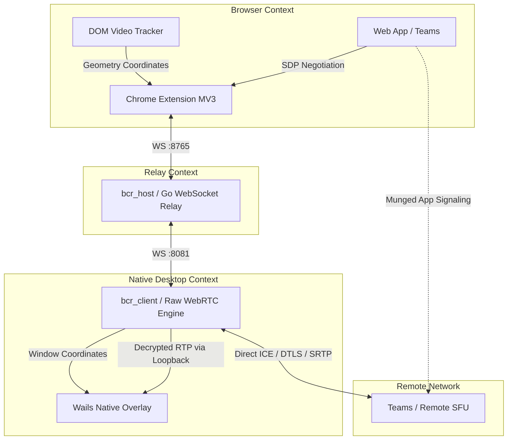
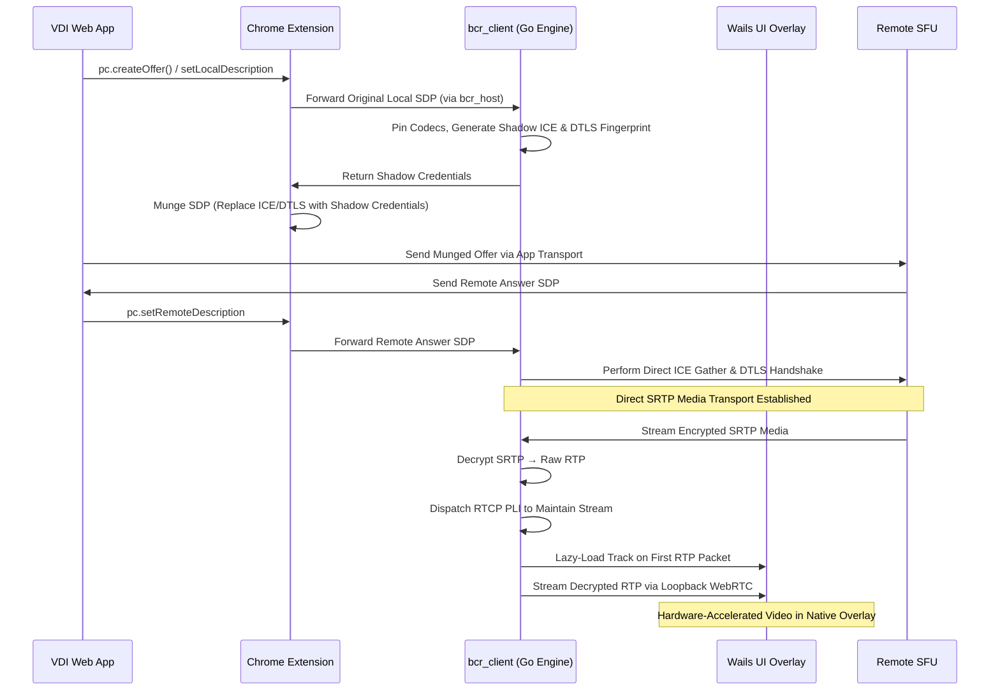

# BCR — Browser Content Relay

> A real-time WebRTC media redirection pipeline that intercepts in-browser RTP streams and redirects them to a hardware-accelerated native desktop overlay — bypassing the browser renderer entirely.

[](https://go.dev/)
[](https://github.com/pion/webrtc)
[](https://wails.io/)
[](https://developer.chrome.com/docs/extensions/mv3/)
[](https://www.kernel.org/)
[](https://webrtc.org/)

---

## Overview

In Virtual Desktop Infrastructure (VDI) and heavy browser-based communication apps (e.g., Microsoft Teams on the web), rendering live WebRTC video inside the browser's main thread is expensive: it competes for CPU and GPU resources, introduces latency, and is opaque to native optimization layers.

BCR solves this through **shadow signaling** — a technique that hijacks the WebRTC negotiation at the SDP layer, without modifying the web application or the remote SFU. The result is a direct, out-of-browser SRTP media path from the remote server to a native, always-on-top Wails overlay window that tracks the browser's `<video>` element in real time.

**No screen scraping. No frame repacking. No browser plugin APIs for media access.** BCR operates entirely at the transport layer.

---

## System Architecture



The system comprises three isolated components:

**`video-telemetry-extension`** — A Manifest V3 Chrome extension operating inside the VDI web app. It monkey-patches `RTCPeerConnection` at the prototype level to intercept `createOffer`, `setLocalDescription`, and `setRemoteDescription`. It also tracks the spatial geometry of the target `<video>` DOM element via `ResizeObserver` and `IntersectionObserver`, forwarding all data over WebSocket.

**`bcr_host`** — A lightweight Go middleware server that bridges network isolation between the sandboxed browser extension and the native client. Exposes a WebSocket relay on `:8765` (Chrome) and `:8081` (native client).

**`bcr_client`** — The core engine. It receives hijacked SDPs, synthesizes ICE/DTLS credentials, performs a direct handshake with the remote SFU, handles SRTP decryption, and maintains a local loopback WebRTC session feeding the Wails renderer.

---

## Core Flow



---

## Tech Stack

| Layer | Technology |
|---|---|
| Extension | Vanilla JS, Manifest V3, prototype-level monkey-patching |
| Relay Server | Go 1.22+, Gorilla WebSocket |
| WebRTC Engine | Pion WebRTC (`pion/dtls`, `pion/srtp`, `pion/ice`, `pion/webrtc`) |
| Native Overlay | Wails v2 (Go + WebKit), X11 |
| Protocols | ICE, DTLS-SRTP, RTCP, SDP |
| Platform | Linux (X11), `webkit2gtk4.0` |

---

## Key Features

- **Zero-copy SDP hijacking** — intercepts WebRTC negotiation at the JS prototype level without touching the web application source.
- **Shadow credential synthesis** — generates a synthetic ICE ufrag/pwd and DTLS fingerprint, replacing the browser's in the outbound SDP offer. The remote SFU is unaware of the redirect.
- **Direct SFU transport** — `bcr_client` establishes its own ICE + DTLS-SRTP session directly with the remote server, receiving encrypted media without browser involvement.
- **SRTP decryption pipeline** — raw SRTP packets from the SFU are decrypted using low-level Pion SRTP primitives into plain RTP, bypassing high-level WebRTC API constraints.
- **Lazy track loading** — tracks are added to the local loopback `PeerConnection` only upon arrival of the first RTP packet for that SSRC, preventing premature decoder initialization.
- **DOM geometry tracking** — continuous `ResizeObserver` / `IntersectionObserver` telemetry feeds `<video>` element coordinates to the Wails overlay, which repositions itself frame-accurately over the browser canvas.
- **Codec pinning** — SDP munging enforces a stable VP8/H.264 + Opus media profile, eliminating mid-stream renegotiation instability.

---

## Technical Deep Dive

### 1. Media Starvation via Missing RTCP Feedback

**Problem:** After successfully completing the DTLS handshake with the remote SFU, zero media packets arrived. The connection appeared healthy but was silent.

**Root cause:** Modern SFUs implement receiver-driven media gating. They withhold RTP streams until the receiver demonstrates active RTCP participation — specifically, they wait for a PLI (Picture Loss Indication) or RR (Receiver Report) before committing bandwidth to an unproven path.

**Solution:** Engineered a proactive RTCP feedback loop in the Go engine. On DTLS handshake completion, the client immediately begins dispatching periodic RTCP PLI requests to the SFU. This signals receiver readiness and triggers the SFU to begin streaming. The loop is maintained for the session lifetime to sustain media flow.

---

### 2. WebKit Decoder Deadlocks — "Lazy Track Loading"

**Problem:** When decrypted RTP was fed into the Wails WebKit renderer via a loopback `PeerConnection`, pre-allocating all tracks at session setup caused the renderer to deadlock and crash. Multiple simultaneous decoder initializations in WebKit's media pipeline exceeded safe concurrency bounds.

**Root cause:** WebKit's internal decoder pool has finite capacity. Allocating N decoders simultaneously — before any actual payload has arrived — triggers resource contention, resulting in mutex deadlocks and process termination.

**Solution:** Implemented lazy track loading in `loopback.go`. Tracks are dynamically injected into the local `PeerConnection` only at the moment the first decrypted RTP packet for a given SSRC is observed. This serializes decoder initialization naturally, eliminating the race condition entirely.

---

### 3. Renegotiation Cascades and SDP Role Conflicts

**Problem:** Teams' SFU performs aggressive mid-stream renegotiations — switching codecs, adding/removing tracks, and toggling `a=setup` DTLS roles. Each renegotiation event caused transceiver state mismatches in the shadow session, crashing the local `PeerConnection`.

**Root cause:** The shadow session's codec and DTLS role state diverged from the SFU's expectations during renegotiation, producing SDP offers that violated the established session contract (e.g., conflicting `active`/`passive` role assignments).

**Solution:** Implemented SDP munging at the extension layer to pin the media profile to a single stable codec set (VP8/H.264 + Opus) on the initial offer. Role conflicts were resolved by enforcing a consistent `a=setup:active` posture in all outbound SDPs, preventing the shadow session from entering an indeterminate role state during renegotiation.

---

## Installation

### Prerequisites

- Go 1.22+
- Wails v2 CLI (`go install github.com/wailsapp/wails/v2/cmd/wails@latest`)
- Node.js (for Wails frontend)
- Chromium / Google Chrome
- Linux with X11
- System libraries: `libX11-devel`, `webkit2gtk4.0-devel`

### Step 1 — Start the Relay Server

```bash
cd BCR/bcr_host
go mod tidy
go run .
# Listens on :8765 (Chrome WS) and :8081 (bcr_client control channel)
```

### Step 2 — Start the Native Client Overlay

```bash
cd BCR/bcr_client
go mod tidy
cd frontend && npm install && cd ..
wails dev
# Starts the Wails native renderer and Go WebRTC engine
```

### Step 3 — Load the Chrome Extension

1. Navigate to `chrome://extensions` in Chromium.
2. Enable **Developer mode**.
3. Click **Load unpacked** and select `BCR/video-telemetry-extension/`.

---

## Usage

1. Ensure `bcr_host` and `bcr_client` are running.
2. Open the target web app (e.g., Microsoft Teams on the web) in Chromium with the extension loaded.
3. Join a WebRTC call. The extension intercepts the SDP negotiation automatically.
4. The Wails native overlay appears, positioned over the browser's `<video>` element, rendering the hardware-accelerated stream.

No configuration required for standard deployments. The extension, relay, and client communicate over localhost WebSocket connections established at startup.

---

## Repository Structure

```
BCR/
├── bcr_host/                  # Go WebSocket relay server
├── bcr_client/                # Go WebRTC engine + Wails overlay
│   ├── raw_session.go         # Shadow credential synthesis, direct SFU handshake
│   ├── loopback.go            # Local PeerConnection, lazy track loading
│   └── frontend/              # Wails WebKit renderer
└── video-telemetry-extension/ # Manifest V3 Chrome extension
```
---

## Dynamic Virtual Channel Plugin

To compile the RDP dynamic virtual channel plugin DLL using `g++` inside MSYS2 / MinGW, run the following:
```bash
cd bcr_client/dvc_plugin
g++ -shared -static -o bcr_dvc_plugin.dll dvc_plugin.cpp -lwtsapi32 -lws2_32 -lole32 -luuid
```


## for the optimisation we need to do these things
1. call for the browser native pc.configuration() to get the ice servers at the construcutor
2. use of pre signed dtls certificate to speed up the sdp munging


---

## License

See `LICENSE` for terms.